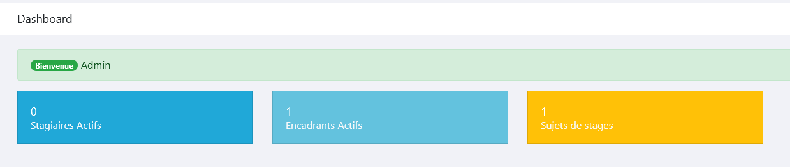
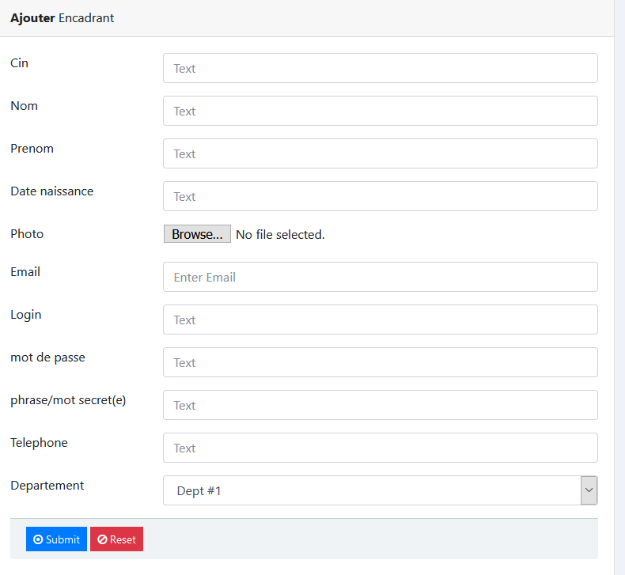
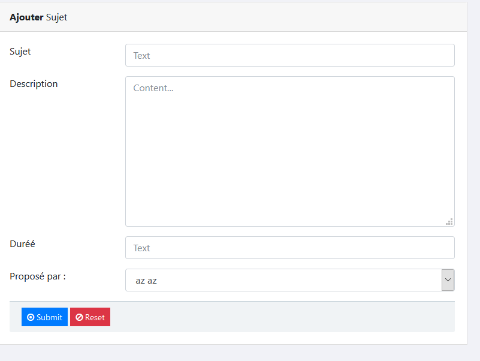
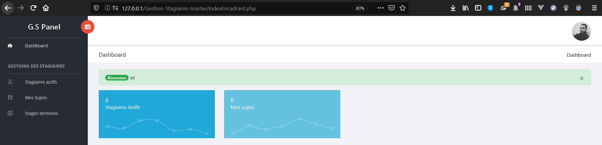
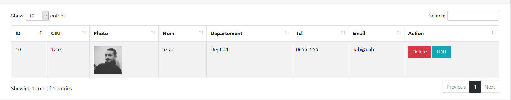
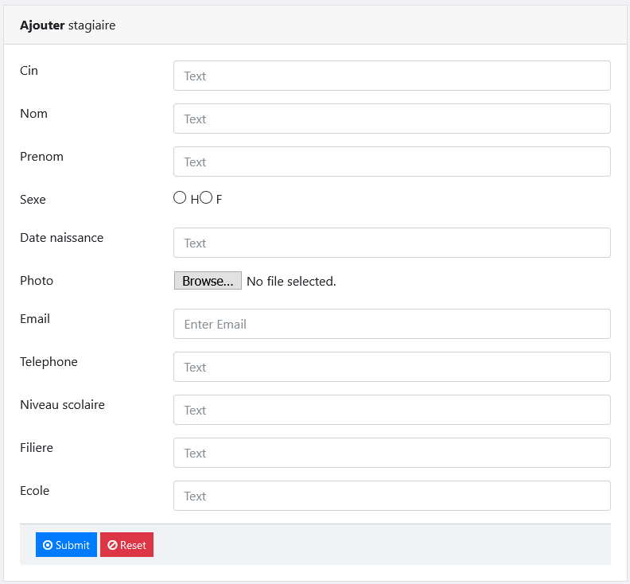
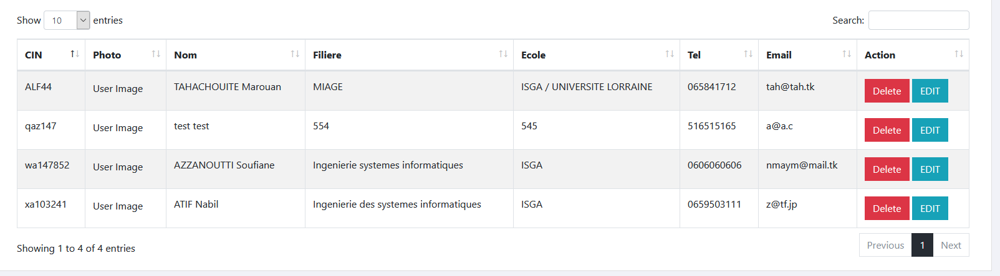

# Gestion Stagiaires / Internships Manager

An old simple webapp i made couple of years ago .
The app was made during an internship and was my first real php oop project.
it keeps track of other interns and supervisors .
mark the interns by the sups.
assign subjects to interns .
list all concluded internships.
list all active internships.
and many more .

Excuse the lack of organisation , i had none back at that time 😆 .
The text is in french as it was required but the code and few comments are all in english .




## Screenshots









## Database 
```
Import the file from the DATABASE folder .
It contains 8 tables

```


## Project setup

```
I used EasyPHP-DevServer-14.1VC9 if i recall .

```

### Notice

```
You can use the project , modify it in any way you wish , credit is appreciated but not mandatory ❤️ !
you can reach me at ZTF666@protonmail.ch or via message => 🌠 www.ztfportfolio.web.app 🌠
```